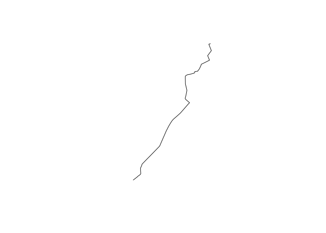
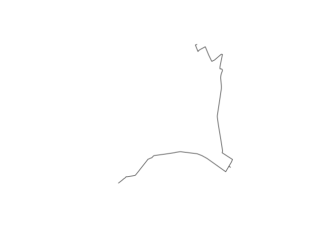

<!-- README.md is generated from README.Rmd. Please edit that file -->
graphhopper-R
=============

[](https://travis-ci.org/crazycapivara/graphhopper-r) [](https://www.repostatus.org/#active)

`graphhopper` - An R Interace to the [graphhopper](https://www.graphhopper.com/) API

Installation
------------

You can install the latest version of `graphhopper` from github with:

``` r
# install.packages("devtools")
devtools::install_github("crazycapivara/graphhopper-r")
```

Get started
-----------

Run your own graphhoper API (Berlin):

``` bash
docker run -p 8989:8989 -d crazycapivara/graphhopper
```

Get a route in Berlin:

``` r
library(graphhopper)

# Setup
API_URL <- "http://localhost:8989/"
gh_set_api_url(API_URL)

start_point <- c(52.592204, 13.414307)
end_point <- c(52.539614, 13.364868)

(route <- gh_get_route(list(start_point, end_point)) %>%
    gh_route_linestring())
#> Simple feature collection with 1 feature and 2 fields
#> geometry type:  LINESTRING
#> dimension:      XY
#> bbox:           xmin: 13.36502 ymin: 52.5395 xmax: 13.41484 ymax: 52.59235
#> epsg (SRID):    4326
#> proj4string:    +proj=longlat +datum=WGS84 +no_defs
#>     time distance                       geometry
#> 1 712414 7676.601 LINESTRING (13.41422 52.592...

sf::st_geometry(route) %>%
  plot()
```



``` r

route$time
#> [1] 712414

via_point <- c(52.545461, 13.435249)

route2 <- gh_get_route(list(start_point, via_point, end_point), miles = TRUE) %>%
  gh_route_linestring()

route2$time
#> [1] 1167141

sf::st_geometry(route2) %>%
  plot()
```



``` r

sf::st_coordinates(route2)[, c("X", "Y")] %>%
  head()
#>             X        Y
#> [1,] 13.41422 52.59235
#> [2,] 13.41322 52.59212
#> [3,] 13.41484 52.58964
#> [4,] 13.41536 52.59003
#> [5,] 13.41599 52.59033
#> [6,] 13.41942 52.59145
```
