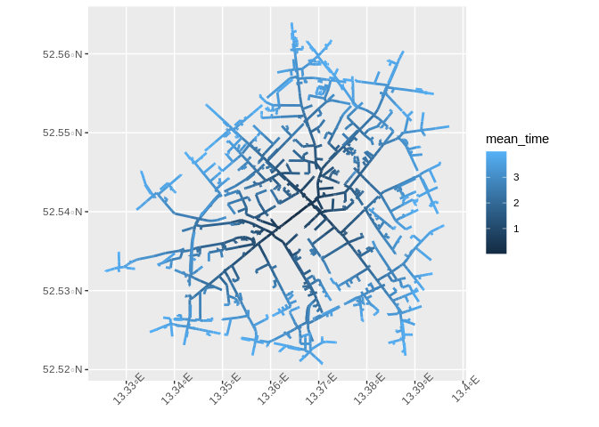
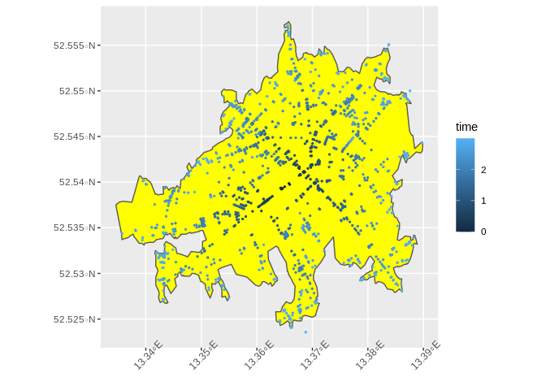

<!-- README.md is generated from README.Rmd. Please edit that file -->

# graphhopper-R

<!-- badges: start -->

[](https://CRAN.R-project.org/package=graphhopper)
[](https://github.com/crazycapivara/graphhopper-r/releases/latest)
[](https://travis-ci.org/crazycapivara/graphhopper-r)
[](https://www.repostatus.org/#active)
[](https://github.com/crazycapivara/graphhopper-r/actions)
<!-- badges: end -->

An R Interface to the [GraphHopper](https://www.graphhopper.com/)
Directions API

The purpose of {graphhopper} is to provide a quick and easy access to
the GraphHopper Directions API. Responses can be converted into simple
feature (sf) objects in a convenient way. The package is not a complete
wrapper of the API. Currently it mainly supports the API also included
in [Graphhopper’s Open Source routing
engine](https://github.com/graphhopper/graphhopper). New features will
be added continuously.

Dive into the [documentation
here](https://crazycapivara.github.io/graphhopper-r/).

## Installation

Install the release version from [CRAN](https://cran.r-project.org/)
with:

``` r
install.packages("graphhopper")
```

Install the development version from [GitHub](https://github.com/) with:

``` r
# install.packages("remotes")
remotes::install_github("crazycapivara/graphhopper-r")
```

## Get started

Run your own GraphHopper instance (with data of Berlin):

``` bash
docker run --name gh --rm -p 8989:8989 -d graphhopper/graphhopper:2.0
```

### Setup

``` r
library(graphhopper)

API_URL <- "http://localhost:8989"
gh_set_api_url(API_URL)

info <- gh_get_info()

info$version
#> [1] "2.0"
info$data_date
#> [1] "2020-12-04T21:42:03Z"
gh_bbox(info)
#> [1] 13.06979 52.33306 13.76352 52.67962
```

### Route

Get a route in Berlin:

``` r
start_point <- c(52.592204, 13.414307)
end_point <- c(52.539614, 13.364868)

(route <- gh_get_route(list(start_point, end_point)) %>%
    gh_as_sf())
#> Simple feature collection with 1 feature and 2 fields
#> geometry type:  LINESTRING
#> dimension:      XY
#> bbox:           xmin: 13.36501 ymin: 52.53949 xmax: 13.41483 ymax: 52.59234
#> CRS:            EPSG:4326
#>     time distance                       geometry
#> 1 697420 7541.438 LINESTRING (13.41422 52.592...

ggplot(data = route) +
  geom_sf() +
  theme(axis.text.x = element_text(angle = 45))
```

<!-- -->

``` r

route$time
#> [1] 697420

via_point <- c(52.545461, 13.435249)

route2 <- gh_get_route(list(start_point, via_point, end_point))

gh_time_distance(route2)
#> $time
#> [1] 1168950
#> 
#> $distance
#> [1] 12843.67

ggplot(data = gh_as_sf(route2)) +
  geom_sf() +
  theme(axis.text.x = element_text(angle = 45))
```

<!-- -->

``` r

gh_points(route2) %>%
  head()
#>        lon      lat gh_id
#> 1 13.41422 52.59234     0
#> 2 13.41321 52.59212     1
#> 3 13.41483 52.58964     2
#> 4 13.41539 52.59004     3
#> 5 13.41599 52.59032     4
#> 6 13.41942 52.59145     5

gh_instructions(route2)[, c("lon", "lat", "gh_id", "gh_end_id", "text", "distance")] %>%
  head()
#>        lon      lat gh_id gh_end_id                                   text
#> 1 13.41422 52.59234     0         1        Continue onto Buchholzer Straße
#> 2 13.41321 52.59212     1         2       Turn left onto Buchholzer Straße
#> 3 13.41483 52.58964     2         5 Turn sharp left onto Buchholzer Straße
#> 4 13.41942 52.59145     5         8         Turn right onto Grumbkowstraße
#> 5 13.42352 52.58588     8        15    Turn left onto Blankenburger Straße
#> 6 13.43019 52.58851    15        18      Turn right onto Pasewalker Straße
#>   distance
#> 1   72.248
#> 2  296.761
#> 3  373.025
#> 4  678.120
#> 5  556.120
#> 6  619.849
```

### Shortest path tree

``` r
start_point <- c(52.53961, 13.36487)

points_sf <- gh_get_spt(start_point, time_limit = 180) %>%
  gh_as_sf() %>%
  dplyr::mutate(time = (time / 1000 / 60))

ggplot() +
  geom_sf(data = points_sf, aes(colour = time), size = 0.5) +
  theme(axis.text.x = element_text(angle = 45))
```

<!-- -->

Also query previous nodes to plot the network:

``` r
(columns <- gh_spt_columns(
  prev_longitude = TRUE,
  prev_latitude = TRUE,
  prev_time = TRUE
))
#> [1] "longitude"      "latitude"       "time"           "distance"      
#> [5] "prev_longitude" "prev_latitude"  "prev_time"

lines_sf <- gh_get_spt(end_point, time_limit = 240, columns = columns) %>%
  dplyr::mutate(mean_time = ((time + prev_time) / 2) / 1000 / 60) %>%
  gh_spt_as_linestrings_sf()

ggplot() +
  geom_sf(data = lines_sf, aes(color = mean_time), size = 1) +
  theme(axis.text.x = element_text(angle = 45))
```

<!-- -->

### Isochrone

``` r
start_point <- c(52.53961, 13.36487)

isochrone_sf <- gh_get_isochrone(start_point, time_limit = 180) %>%
  gh_as_sf()

ggplot() +
  geom_sf(data = isochrone_sf, fill = "yellow") +
  geom_sf(data = points_sf, aes(colour = time), size = 0.5) +
  theme(axis.text.x = element_text(angle = 45))
```

<!-- -->
